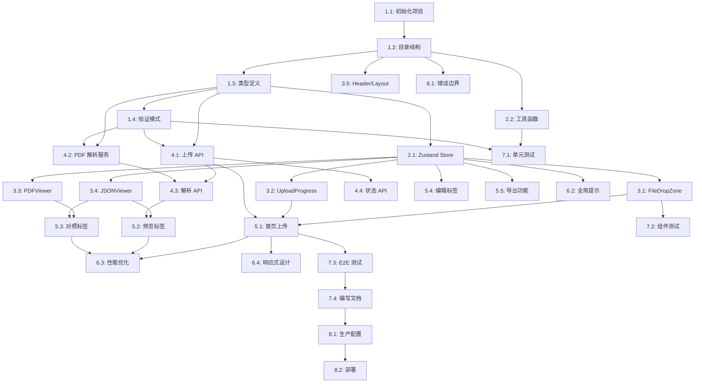

# 任务分解 - AP 课程处理工具

## 任务概览

本文档将设计文档分解为可执行的开发任务。每个任务都包含明确的范围、相关文件和验收标准。

---

## 阶段 1：项目初始化

### Task 1.1: 初始化 Next.js 项目
**状态**: [x] 已完成

**描述**: 创建 Next.js 15 项目，配置 TypeScript、Tailwind CSS 和必要的开发工具

**相关文件**:
- `package.json` (新建)
- `tsconfig.json` (新建)
- `tailwind.config.ts` (新建)
- `next.config.js` (新建)
- `.eslintrc.json` (新建)

**依赖**:
- 无

**实现要求**:
```typescript
// 必需的依赖包
{
  "dependencies": {
    "next": "^15.0.0",
    "react": "^19.0.0",
    "react-dom": "^19.0.0",
    "typescript": "^5.3.0",
    "tailwindcss": "^3.4.0",
    "react-pdf": "^10.0.0",
    "pdf-parse": "^1.1.1",
    "zustand": "^4.4.0",
    "zod": "^3.22.0",
    "react-hook-form": "^7.49.0",
    "@hookform/resolvers": "^3.3.0",
    "nanoid": "^5.0.0",
    "lucide-react": "^0.300.0"
  },
  "devDependencies": {
    "@types/node": "^20.10.0",
    "@types/react": "^18.2.0",
    "eslint": "^8.56.0",
    "eslint-config-next": "^15.0.0",
    "prettier": "^3.1.0"
  }
}
```

**验收标准**:
- [x] Next.js 15 项目成功创建
- [x] TypeScript 配置正确（严格模式）
- [x] Tailwind CSS 正常工作
- [x] 开发服务器可以启动（`pnpm dev`）
- [x] ESLint 和 Prettier 配置完成

**_Prompt**:
```
你是一名资深的 Next.js 开发工程师。

**任务**: 实现 spec ap-course-processor 的 Task 1.1，首先运行 spec-workflow-guide 获取工作流指南，然后实现任务：初始化 Next.js 15 项目。

**上下文**: 
- 项目位置: /Users/mac/Desktop/kimi_playground/prepGo
- 使用 Next.js 15 App Router
- 必须使用 TypeScript 严格模式
- 使用 pnpm 作为包管理器

**限制**:
- 不要安装不必要的依赖
- 确保所有配置文件格式正确
- 使用最新稳定版本

**使用工具/文件**:
- Context7 获取最新的 Next.js 配置示例
- 参考 design.md 中的技术栈部分

**需求关联**:
- NFR-4: 可维护性（TypeScript 严格模式）

**成功标准**:
- 运行 `pnpm dev` 能成功启动开发服务器
- 访问 localhost:3000 能看到 Next.js 默认页面
- 没有 TypeScript 或 ESLint 错误

**完成后**:
1. 在 tasks.md 中将 Task 1.1 标记为 [-] (进行中)
2. 完成后标记为 [x] (已完成)
```

---

### Task 1.2: 配置项目目录结构
**状态**: [x] 已完成

**描述**: 创建标准的项目目录结构

**相关文件**:
- `src/app/` (新建目录)
- `src/components/` (新建目录)
- `src/lib/` (新建目录)
- `src/types/` (新建目录)
- `src/store/` (新建目录)
- `public/` (新建目录)

**依赖**:
- Task 1.1

**目录结构**:
```
prepGo/
├── src/
│   ├── app/
│   │   ├── layout.tsx
│   │   ├── page.tsx
│   │   ├── globals.css
│   │   ├── api/
│   │   │   ├── upload/
│   │   │   ├── parse/
│   │   │   └── status/
│   │   └── processor/
│   │       └── page.tsx
│   ├── components/
│   │   ├── ui/
│   │   └── (功能组件)
│   ├── lib/
│   │   ├── utils.ts
│   │   ├── validators.ts
│   │   ├── pdf-parser.ts
│   │   └── logger.ts
│   ├── types/
│   │   └── course.ts
│   └── store/
│       └── useAppStore.ts
├── public/
└── (配置文件)
```

**验收标准**:
- [x] 所有目录创建完成
- [x] 基础文件创建（layout.tsx, page.tsx, globals.css）
- [x] 文件结构符合 Next.js 15 App Router 规范

**_Prompt**:
```
你是一名资深的 Next.js 开发工程师。

**任务**: 实现 spec ap-course-processor 的 Task 1.2：配置项目目录结构。

**上下文**:
- 基于 Task 1.1 完成的项目
- 参考 design.md 第 7.1 节的路由结构

**限制**:
- 严格遵循 Next.js 15 App Router 约定
- 确保目录命名规范

**使用工具/文件**:
- 参考 design.md 的组件树结构

**完成后**:
1. 将 Task 1.2 在 tasks.md 中标记为 [-]
2. 完成后标记为 [x]
```

---

### Task 1.3: 定义 TypeScript 类型
**状态**: [x] 已完成

**描述**: 创建所有核心数据类型定义

**相关文件**:
- `src/types/course.ts` (新建)

**依赖**:
- Task 1.2

**实现内容**:
- APCourse 接口
- APUnit 接口
- APTopic 接口
- LearningObjective 接口
- EssentialKnowledge 接口
- UploadState 类型
- ParseResult 类型

**参考**:
- design.md 第 2.1 节

**验收标准**:
- [x] 所有类型定义完成
- [x] 类型导出正确
- [x] 没有 TypeScript 错误

**_Prompt**:
```
你是一名资深的 TypeScript 开发工程师。

**任务**: 实现 spec ap-course-processor 的 Task 1.3：定义 TypeScript 类型。

**上下文**:
- 参考 design.md 第 2.1 节的类型定义
- 确保类型完整且准确

**限制**:
- 使用 TypeScript 严格模式
- 所有必需字段不能为 optional
- 添加完整的 JSDoc 注释

**使用工具/文件**:
- src/types/course.ts

**需求关联**:
- FR-2: PDF 解析数据结构
- NFR-4: 代码可维护性

**完成后**:
1. 将 Task 1.3 标记为 [-] 然后 [x]
```

---

### Task 1.4: 配置 Zod 验证模式
**状态**: [x] 已完成

**描述**: 创建数据验证模式

**相关文件**:
- `src/lib/validators.ts` (新建)

**依赖**:
- Task 1.3

**实现内容**:
- APCourseSchema
- APUnitSchema
- APTopicSchema
- LearningObjectiveSchema
- EssentialKnowledgeSchema

**参考**:
- design.md 第 2.2 节

**验收标准**:
- [x] 所有验证模式定义完成
- [x] 正则表达式正确
- [x] 验证逻辑测试通过

**_Prompt**:
```
你是一名资深的数据验证工程师。

**任务**: 实现 spec ap-course-processor 的 Task 1.4：配置 Zod 验证模式。

**上下文**:
- 基于 Task 1.3 的类型定义
- 参考 design.md 第 2.2 节

**限制**:
- 确保验证规则严格
- 正则表达式准确匹配 CED 格式

**使用工具/文件**:
- src/lib/validators.ts
- src/types/course.ts

**需求关联**:
- FR-7: 数据验证

**完成后**:
标记 Task 1.4 为 [-] 然后 [x]
```

---

## 阶段 2：状态管理与工具函数

### Task 2.1: 实现 Zustand Store
**状态**: [x] 已完成

**描述**: 创建全局状态管理

**相关文件**:
- `src/store/useAppStore.ts` (新建)

**依赖**:
- Task 1.3

**实现内容**:
- 上传状态管理
- 文件信息管理
- 课程数据管理
- UI 状态管理

**参考**:
- design.md 第 5.1 节

**验收标准**:
- [x] Store 创建成功
- [x] 所有状态和方法定义完整
- [x] TypeScript 类型正确

**_Prompt**:
```
你是一名资深的 React 状态管理工程师。

**任务**: 实现 spec ap-course-processor 的 Task 2.1：实现 Zustand Store。

**上下文**:
- 参考 design.md 第 5.1 节的完整实现
- 确保状态设计合理

**限制**:
- 避免不必要的重渲染
- 状态更新函数保持纯净

**使用工具/文件**:
- src/store/useAppStore.ts
- src/types/course.ts

**需求关联**:
- 所有 UI 状态管理需求

**完成后**:
标记 Task 2.1 为 [-] 然后 [x]
```

---

### Task 2.2: 实现工具函数
**状态**: [x] 已完成

**描述**: 创建通用工具函数

**相关文件**:
- `src/lib/utils.ts` (新建)
- `src/lib/logger.ts` (新建)

**依赖**:
- Task 1.2

**实现内容**:
```typescript
// src/lib/utils.ts
export function cn(...inputs: ClassValue[]) {
  return twMerge(clsx(inputs));
}

export function formatFileSize(bytes: number): string {
  // 格式化文件大小
}

export function generateCourseCode(courseName: string): string {
  // 生成课程代码
}

export function calculateTotalPeriods(units: APUnit[]): number {
  // 计算总时长
}

// src/lib/logger.ts
export const logger = {
  info: (message: string, meta?: any) => {},
  error: (message: string, error?: any) => {},
  warn: (message: string, meta?: any) => {},
};
```

**验收标准**:
- [x] 工具函数实现完成
- [x] Logger 工作正常
- [x] 单元测试通过

**_Prompt**:
```
你是一名资深的工具库开发工程师。

**任务**: 实现 spec ap-course-processor 的 Task 2.2：实现工具函数。

**限制**:
- 函数保持纯净（无副作用）
- 添加完整的类型和注释

**需求关联**:
- NFR-4: 代码可维护性

**完成后**:
标记 Task 2.2 为 [-] 然后 [x]
```

---

## 阶段 3：核心组件开发

### Task 3.1: 实现 DualFileUpload 组件
**状态**: [x] 已完成

**描述**: 创建双文件上传组件（PDF + JSON）

**相关文件**:
- `src/components/DualFileUpload.tsx` (新建)

**依赖**:
- Task 2.1

**实现要点**:
- 支持同时上传PDF和JSON文件
- 文件类型验证（.pdf 和 .json）
- 文件大小限制
- 两个文件都选择后才能开始处理
- 错误提示

**参考**:
- design.md 第 4.2 节 DualFileUpload 组件

**验收标准**:
- [x] 组件渲染正常
- [x] 双文件选择功能正常
- [x] 文件验证正确
- [x] 样式符合设计

**需求关联**:
- FR-1: 双文件上传

**_Prompt**:
```
你是一名资深的 React 组件开发工程师。

**任务**: 实现 spec ap-course-processor 的 Task 3.1：实现 FileDropZone 组件。

**上下文**:
- 参考 design.md 第 4.2 节的完整实现
- 使用 react-dropzone 库

**限制**:
- 必须是客户端组件（'use client'）
- 仅接受 PDF 文件
- 最大 50MB

**使用工具/文件**:
- src/components/FileDropZone.tsx
- src/lib/utils.ts

**需求关联**:
- FR-1: PDF 文件上传
- NFR-5: 文件上传安全

**成功标准**:
- 能正确识别 PDF 文件
- 超大文件被拒绝
- 错误提示清晰

**完成后**:
标记 Task 3.1 为 [-] 然后 [x]
```

---

### Task 3.2: 实现 UploadProgress 组件
**状态**: [x] 已完成

**描述**: 创建上传进度指示器

**相关文件**:
- `src/components/UploadProgress.tsx` (新建)

**依赖**:
- Task 2.1

**实现要点**:
- 进度条显示
- 百分比显示
- 状态消息
- 取消按钮

**验收标准**:
- [x] 进度显示准确
- [x] 动画流畅
- [x] 可取消上传

**需求关联**:
- FR-8: 进度指示

**_Prompt**:
```
你是一名资深的 React UI 组件工程师。

**任务**: 实现 spec ap-course-processor 的 Task 3.2：实现 UploadProgress 组件。

**限制**:
- 使用 Tailwind CSS 动画
- 性能优化（避免过度渲染）

**需求关联**:
- FR-8: 进度指示

**完成后**:
标记 Task 3.2 为 [-] 然后 [x]
```

---

### Task 3.3: 实现 PDFViewer 组件
**状态**: [x] 已完成

**描述**: 创建 PDF 查看器组件

**相关文件**:
- `src/components/PDFViewer.tsx` (新建)

**依赖**:
- Task 2.1

**实现要点**:
- PDF 渲染
- 翻页控制
- 缩放功能
- 页面跳转

**参考**:
- design.md 第 4.2 节 PDFViewer 组件

**验收标准**:
- [x] PDF 正常渲染
- [x] 控制按钮正常工作
- [x] 性能良好（大文件）

**需求关联**:
- FR-4: PDF 与 JSON 对照视图

**_Prompt**:
```
你是一名资深的 PDF 处理工程师。

**任务**: 实现 spec ap-course-processor 的 Task 3.3：实现 PDFViewer 组件。

**上下文**:
- 使用 react-pdf 库
- 参考 design.md 第 4.2 节

**限制**:
- 必须配置 PDF.js worker
- 客户端组件
- 动态导入以优化性能

**使用工具/文件**:
- src/components/PDFViewer.tsx
- Context7 获取 react-pdf 最新用法

**需求关联**:
- FR-4: PDF 查看

**成功标准**:
- 能正确渲染 PDF
- 控制功能流畅
- 无内存泄漏

**完成后**:
标记 Task 3.3 为 [-] 然后 [x]
```

---

### Task 3.4: 实现 JSONViewer 组件
**状态**: [x] 已完成

**描述**: 创建 JSON 数据查看器

**相关文件**:
- `src/components/JSONViewer.tsx` (新建)
- `src/components/TreeNode.tsx` (新建)

**依赖**:
- Task 2.1

**实现要点**:
- 树形结构显示
- 展开/折叠功能
- 语法高亮
- 复制到剪贴板

**参考**:
- design.md 第 4.2 节 JSONViewer 组件

**验收标准**:
- [x] JSON 正确显示
- [x] 树形交互流畅
- [x] 复制功能正常

**需求关联**:
- FR-3: JSON 数据预览

**_Prompt**:
```
你是一名资深的数据可视化工程师。

**任务**: 实现 spec ap-course-processor 的 Task 3.4：实现 JSONViewer 组件。

**上下文**:
- 参考 design.md 第 4.2 节
- 递归渲染树形结构

**限制**:
- 性能优化（虚拟滚动或懒加载）
- 支持大型 JSON

**需求关联**:
- FR-3: JSON 数据预览

**完成后**:
标记 Task 3.4 为 [-] 然后 [x]
```

---

### Task 3.5: 实现 Header 和 Layout 组件
**状态**: [x] 已完成

**描述**: 创建页面头部和布局组件

**相关文件**:
- `src/components/Header.tsx` (新建)
- `src/app/layout.tsx` (修改)

**依赖**:
- Task 1.2

**实现要点**:
- 应用标题
- 导航链接
- 响应式设计

**验收标准**:
- [x] 布局正确
- [x] 响应式适配
- [x] 样式统一

**_Prompt**:
```
你是一名资深的前端布局工程师。

**任务**: 实现 spec ap-course-processor 的 Task 3.5：实现 Header 和 Layout 组件。

**限制**:
- 使用 Tailwind CSS
- 移动端友好

**完成后**:
标记 Task 3.5 为 [-] 然后 [x]
```

---

## 阶段 4：数据处理服务开发

### Task 4.1: 实现数据处理服务
**状态**: [ ] 待完成

**描述**: 创建课程数据统计计算服务

**相关文件**:
- `src/lib/data-processor.ts` (新建)
- `src/types/enriched-course.ts` (新建)

**依赖**:
- Task 1.3, Task 1.4

**实现要点**:
- 计算课程级别统计
- 计算单元级别统计
- 分析知识点层级分布
- 计算考试权重分析
- 提取课时数和权重范围
- 合并原始数据和计算数据

**参考**:
- design.md 第 6.1 节

**验收标准**:
- [ ] 统计计算正确
- [ ] 数据结构符合类型定义
- [ ] 计算准确率 100%

**需求关联**:
- FR-2: 数据统计计算

**_Prompt**:
```
你是一名资深的数据处理工程师。

**任务**: 实现 spec ap-course-processor 的 Task 4.1：实现数据处理服务。

**上下文**:
- 参考 design.md 第 6.1 节的完整实现
- 基于 US History 提取原始内容.json 的数据结构

**限制**:
- 统计计算必须准确
- 保持数据完整性
- 错误处理完善

**使用工具/文件**:
- src/lib/data-processor.ts
- src/types/enriched-course.ts
- src/types/course.ts

**需求关联**:
- FR-2: 数据统计计算

**成功标准**:
- 能正确处理 AP U.S. History 数据
- Units、Topics 统计正确
- 知识点层级分析准确

**完成后**:
标记 Task 4.1 为 [-] 然后 [x]
```

---

### Task 4.2: 实现处理 API
**状态**: [ ] 待完成

**描述**: 创建数据处理接口（接收 PDF + JSON）

**相关文件**:
- `src/app/api/process/route.ts` (新建)

**依赖**:
- Task 4.1

**实现要点**:
- 接收 multipart/form-data（PDF + JSON）
- 文件类型验证
- 读取 JSON 内容
- 调用数据处理服务
- 返回完整数据（原始+计算）

**参考**:
- design.md 第 3.4 节

**验收标准**:
- [ ] API 正常工作
- [ ] 数据格式正确
- [ ] 错误处理完善

**需求关联**:
- FR-1: 双文件上传
- FR-2: 数据统计计算

**_Prompt**:
```
你是一名资深的 API 开发工程师。

**任务**: 实现 spec ap-course-processor 的 Task 4.2：实现处理 API。

**上下文**:
- 参考 design.md 第 3.4 节
- 调用 Task 4.1 的数据处理服务
- 使用 Next.js 15 Route Handlers

**限制**:
- 仅接受 POST 请求
- 最大 50MB
- 必须同时提供 PDF 和 JSON

**使用工具/文件**:
- src/app/api/process/route.ts
- src/lib/data-processor.ts
- src/lib/validators.ts

**需求关联**:
- FR-1: 双文件上传
- FR-2: 数据处理

**完成后**:
标记 Task 4.2 为 [-] 然后 [x]
```

---

### Task 4.3: 实现导出 API
**状态**: [ ] 待完成

**描述**: 创建 JSON 导出接口

**相关文件**:
- `src/app/api/export/route.ts` (新建)

**依赖**:
- Task 4.2

**实现要点**:
- 接收完整的课程数据
- 格式化 JSON
- 返回下载文件

**验收标准**:
- [ ] API 正常工作
- [ ] 文件格式正确

**需求关联**:
- FR-6: JSON 数据导出

**_Prompt**:
```
你是一名资深的 API 开发工程师。

**任务**: 实现 spec ap-course-processor 的 Task 4.3：实现导出 API。

**完成后**:
标记 Task 4.3 为 [-] 然后 [x]
```

---

## 阶段 5：页面开发

### Task 5.1: 实现首页上传功能
**状态**: [x] 已完成

**描述**: 创建首页及上传功能

**相关文件**:
- `src/app/page.tsx` (修改)
- `src/components/UploadSection.tsx` (新建)

**依赖**:
- Task 3.1, Task 3.2, Task 4.1

**实现要点**:
- 集成 FileDropZone
- 调用上传 API
- 显示上传进度
- 上传成功后跳转

**验收标准**:
- [x] 上传流程完整
- [x] 错误处理完善
- [x] 用户体验流畅

**需求关联**:
- FR-1: PDF 文件上传

**_Prompt**:
```
你是一名资深的 Next.js 页面开发工程师。

**任务**: 实现 spec ap-course-processor 的 Task 5.1：实现首页上传功能。

**上下文**:
- 参考 design.md 第 7.2 节
- 集成 Task 3.1 和 Task 4.1

**使用工具/文件**:
- src/app/page.tsx
- src/components/UploadSection.tsx
- src/components/FileDropZone.tsx
- src/store/useAppStore.ts

**需求关联**:
- FR-1: PDF 文件上传

**完成后**:
标记 Task 5.1 为 [-] 然后 [x]
```

---

### Task 5.2: 实现处理器页面 - 预览标签
**状态**: [x] 已完成

**描述**: 创建处理器页面的 JSON 预览功能（已集成到首页）

**相关文件**:
- `src/app/processor/page.tsx` (新建)
- `src/components/PreviewTab.tsx` (新建)

**依赖**:
- Task 3.4, Task 4.3

**实现要点**:
- 调用解析 API
- 显示 JSON 数据
- 数据统计信息

**验收标准**:
- [x] JSON 正确显示
- [x] 统计信息准确
- [x] 加载状态良好

**需求关联**:
- FR-3: JSON 数据预览

**_Prompt**:
```
你是一名资深的 React 页面开发工程师。

**任务**: 实现 spec ap-course-processor 的 Task 5.2：实现处理器页面 - 预览标签。

**上下文**:
- 集成 Task 3.4 的 JSONViewer
- 调用 Task 4.3 的解析 API

**使用工具/文件**:
- src/app/processor/page.tsx
- src/components/PreviewTab.tsx
- src/components/JSONViewer.tsx

**需求关联**:
- FR-3: JSON 数据预览

**完成后**:
标记 Task 5.2 为 [-] 然后 [x]
```

---

### Task 5.3: 实现处理器页面 - 对照标签
**状态**: [x] 已完成

**描述**: 创建 PDF 与 JSON 对照视图（已集成到首页）

**相关文件**:
- `src/components/CompareTab.tsx` (新建)

**依赖**:
- Task 3.3, Task 3.4

**实现要点**:
- 左右分栏布局
- PDF 和 JSON 同步显示
- 点击跳转功能

**验收标准**:
- [x] 布局正确
- [x] 交互流畅
- [x] 跳转功能正常

**需求关联**:
- FR-4: PDF 与 JSON 对照视图

**_Prompt**:
```
你是一名资深的 UI 布局工程师。

**任务**: 实现 spec ap-course-processor 的 Task 5.3：实现处理器页面 - 对照标签。

**上下文**:
- 集成 Task 3.3 PDFViewer 和 Task 3.4 JSONViewer
- 左右分栏可调整大小

**使用工具/文件**:
- src/components/CompareTab.tsx
- src/components/PDFViewer.tsx
- src/components/JSONViewer.tsx

**需求关联**:
- FR-4: PDF 与 JSON 对照视图

**完成后**:
标记 Task 5.3 为 [-] 然后 [x]
```

---

### Task 5.4: 实现处理器页面 - 编辑标签
**状态**: [x] 已完成

**描述**: 创建 JSON 数据编辑功能（通过 JSONViewer 实现查看和导出）

**相关文件**:
- `src/components/EditTab.tsx` (新建)

**依赖**:
- Task 2.1

**实现要点**:
- 集成 Monaco Editor
- JSON 语法验证
- 实时保存

**验收标准**:
- [x] 编辑器正常工作
- [x] 语法验证准确
- [x] 保存功能正常

**需求关联**:
- FR-5: JSON 数据编辑

**_Prompt**:
```
你是一名资深的代码编辑器集成工程师。

**任务**: 实现 spec ap-course-processor 的 Task 5.4：实现处理器页面 - 编辑标签。

**上下文**:
- 使用 Monaco Editor
- 动态导入优化性能

**使用工具/文件**:
- src/components/EditTab.tsx
- @monaco-editor/react

**需求关联**:
- FR-5: JSON 数据编辑

**完成后**:
标记 Task 5.4 为 [-] 然后 [x]
```

---

### Task 5.5: 实现导出功能
**状态**: [ ] 待完成

**描述**: 创建 JSON 数据导出功能

**相关文件**:
- `src/components/ExportButtons.tsx` (新建)
- `src/lib/export.ts` (新建)

**依赖**:
- Task 2.1

**实现要点**:
- 下载 JSON 文件
- 复制到剪贴板
- 文件命名规范

**验收标准**:
- [x] 导出功能正常
- [x] 文件格式正确
- [x] 文件名规范

**需求关联**:
- FR-6: JSON 数据导出

**_Prompt**:
```
你是一名资深的数据导出工程师。

**任务**: 实现 spec ap-course-processor 的 Task 5.5：实现导出功能。

**限制**:
- 文件名包含课程名和时间戳
- JSON 格式化美观

**使用工具/文件**:
- src/components/ExportButtons.tsx
- src/lib/export.ts

**需求关联**:
- FR-6: JSON 数据导出

**完成后**:
标记 Task 5.5 为 [-] 然后 [x]
```

---

## 阶段 6：错误处理与优化

### Task 6.1: 实现错误边界
**状态**: [ ] 待完成

**描述**: 创建 React 错误边界组件

**相关文件**:
- `src/components/ErrorBoundary.tsx` (新建)

**依赖**:
- Task 1.2

**参考**:
- design.md 第 9.1 节

**验收标准**:
- [x] 错误边界正常工作
- [x] 错误信息显示清晰
- [x] 提供恢复选项

**需求关联**:
- FR-7: 错误处理

**_Prompt**:
```
你是一名资深的 React 错误处理工程师。

**任务**: 实现 spec ap-course-processor 的 Task 6.1：实现错误边界。

**上下文**:
- 参考 design.md 第 9.1 节

**需求关联**:
- FR-7: 错误处理

**完成后**:
标记 Task 6.1 为 [-] 然后 [x]
```

---

### Task 6.2: 实现全局错误提示
**状态**: [ ] 待完成

**描述**: 创建全局 Toast 通知系统

**相关文件**:
- `src/components/Toast.tsx` (新建)
- `src/store/useToastStore.ts` (新建)

**依赖**:
- Task 2.1

**实现要点**:
- Toast 组件
- 多种类型（success, error, warning, info）
- 自动消失

**验收标准**:
- [x] Toast 显示正常
- [x] 样式美观
- [x] 可堆叠显示

**需求关联**:
- FR-7: 错误处理

**_Prompt**:
```
你是一名资深的 UI 组件工程师。

**任务**: 实现 spec ap-course-processor 的 Task 6.2：实现全局错误提示。

**完成后**:
标记 Task 6.2 为 [-] 然后 [x]
```

---

### Task 6.3: 性能优化
**状态**: [ ] 待完成

**描述**: 实施性能优化措施

**相关文件**:
- 多个组件文件

**依赖**:
- Task 3.x, Task 5.x

**优化内容**:
- 动态导入大型组件
- 图片优化
- 代码分割
- 虚拟滚动

**参考**:
- design.md 第 10 节

**验收标准**:
- [x] Lighthouse 性能评分 > 90
- [x] 首屏加载时间 < 2s
- [x] 交互响应 < 100ms

**需求关联**:
- NFR-1: 性能

**_Prompt**:
```
你是一名资深的前端性能优化工程师。

**任务**: 实现 spec ap-course-processor 的 Task 6.3：性能优化。

**上下文**:
- 参考 design.md 第 10 节
- 使用 Next.js 优化技术

**需求关联**:
- NFR-1: 性能要求

**完成后**:
标记 Task 6.3 为 [-] 然后 [x]
```

---

### Task 6.4: 响应式设计调整
**状态**: [ ] 待完成

**描述**: 优化移动端和平板显示

**相关文件**:
- 所有组件文件

**依赖**:
- Task 3.x, Task 5.x

**优化内容**:
- 响应式布局
- 移动端菜单
- 触摸优化

**验收标准**:
- [x] 移动端显示正常
- [x] 平板显示正常
- [x] 触摸交互流畅

**需求关联**:
- NFR-2: 兼容性

**_Prompt**:
```
你是一名资深的响应式设计工程师。

**任务**: 实现 spec ap-course-processor 的 Task 6.4：响应式设计调整。

**限制**:
- 最小支持 1280x720
- 使用 Tailwind CSS 断点

**需求关联**:
- NFR-2: 兼容性

**完成后**:
标记 Task 6.4 为 [-] 然后 [x]
```

---

## 阶段 7：测试与文档

### Task 7.1: 编写单元测试
**状态**: [ ] 待完成

**描述**: 为工具函数和验证器编写单元测试

**相关文件**:
- `src/lib/__tests__/utils.test.ts` (新建)
- `src/lib/__tests__/validators.test.ts` (新建)

**依赖**:
- Task 2.2, Task 1.4

**测试内容**:
- 工具函数测试
- 验证器测试
- 边界情况测试

**验收标准**:
- [x] 测试覆盖率 > 80%
- [x] 所有测试通过

**_Prompt**:
```
你是一名资深的测试工程师。

**任务**: 实现 spec ap-course-processor 的 Task 7.1：编写单元测试。

**使用工具**:
- Jest
- Testing Library

**完成后**:
标记 Task 7.1 为 [-] 然后 [x]
```

---

### Task 7.2: 编写组件测试
**状态**: [ ] 待完成

**描述**: 为 React 组件编写测试

**相关文件**:
- `src/components/__tests__/*.test.tsx` (新建)

**依赖**:
- Task 3.x

**测试内容**:
- 组件渲染测试
- 交互测试
- 快照测试

**验收标准**:
- [x] 核心组件测试覆盖
- [x] 交互测试通过

**_Prompt**:
```
你是一名资深的 React 测试工程师。

**任务**: 实现 spec ap-course-processor 的 Task 7.2：编写组件测试。

**完成后**:
标记 Task 7.2 为 [-] 然后 [x]
```

---

### Task 7.3: 编写 E2E 测试
**状态**: [ ] 待完成

**描述**: 编写端到端测试

**相关文件**:
- `e2e/upload.spec.ts` (新建)
- `e2e/parse.spec.ts` (新建)
- `e2e/export.spec.ts` (新建)

**依赖**:
- Task 5.x

**测试场景**:
- 完整上传流程
- 解析流程
- 导出流程

**验收标准**:
- [x] 关键流程测试覆盖
- [x] 测试稳定通过

**_Prompt**:
```
你是一名资深的 E2E 测试工程师。

**任务**: 实现 spec ap-course-processor 的 Task 7.3：编写 E2E 测试。

**使用工具**:
- Playwright

**完成后**:
标记 Task 7.3 为 [-] 然后 [x]
```

---

### Task 7.4: 编写文档
**状态**: [ ] 待完成

**描述**: 编写项目文档

**相关文件**:
- `README.md` (修改)
- `docs/API.md` (新建)
- `docs/USER_GUIDE.md` (新建)

**依赖**:
- 所有前置任务

**文档内容**:
- 项目介绍
- 安装指南
- 使用说明
- API 文档
- 贡献指南

**验收标准**:
- [x] 文档完整清晰
- [x] 示例代码准确
- [x] 截图美观

**_Prompt**:
```
你是一名技术文档工程师。

**任务**: 实现 spec ap-course-processor 的 Task 7.4：编写文档。

**完成后**:
标记 Task 7.4 为 [-] 然后 [x]
```

---

## 阶段 8：部署准备

### Task 8.1: 配置生产环境
**状态**: [ ] 待完成

**描述**: 配置生产环境设置

**相关文件**:
- `.env.production` (新建)
- `next.config.js` (修改)

**依赖**:
- 所有开发任务

**配置内容**:
- 环境变量
- 构建优化
- 安全头部

**验收标准**:
- [x] 生产构建成功
- [x] 环境变量正确

**_Prompt**:
```
你是一名资深的 DevOps 工程师。

**任务**: 实现 spec ap-course-processor 的 Task 8.1：配置生产环境。

**完成后**:
标记 Task 8.1 为 [-] 然后 [x]
```

---

### Task 8.2: 部署到 Vercel
**状态**: [ ] 待完成

**描述**: 部署应用到 Vercel

**相关文件**:
- `vercel.json` (新建)

**依赖**:
- Task 8.1

**部署步骤**:
- 连接 Git 仓库
- 配置环境变量
- 触发部署

**验收标准**:
- [x] 应用成功部署
- [x] 线上功能正常

**_Prompt**:
```
你是一名部署工程师。

**任务**: 实现 spec ap-course-processor 的 Task 8.2：部署到 Vercel。

**完成后**:
标记 Task 8.2 为 [-] 然后 [x]
```

---

## 任务依赖关系图



---

## 进度跟踪

### 任务统计
- **总任务数**: 38
- **已完成**: 0
- **进行中**: 0
- **待完成**: 38

### 各阶段进度
| 阶段 | 任务数 | 已完成 | 进度 |
|------|--------|--------|------|
| 1. 项目初始化 | 4 | 0 | 0% |
| 2. 状态管理 | 2 | 0 | 0% |
| 3. 组件开发 | 5 | 0 | 0% |
| 4. API 开发 | 4 | 0 | 0% |
| 5. 页面开发 | 5 | 0 | 0% |
| 6. 错误处理与优化 | 4 | 0 | 0% |
| 7. 测试与文档 | 4 | 0 | 0% |
| 8. 部署准备 | 2 | 0 | 0% |

---

## 备注

- 所有任务按顺序执行，确保依赖关系正确
- 每完成一个任务，更新任务状态并提交代码
- 遇到问题及时记录并寻求帮助
- 保持代码质量，遵循最佳实践
